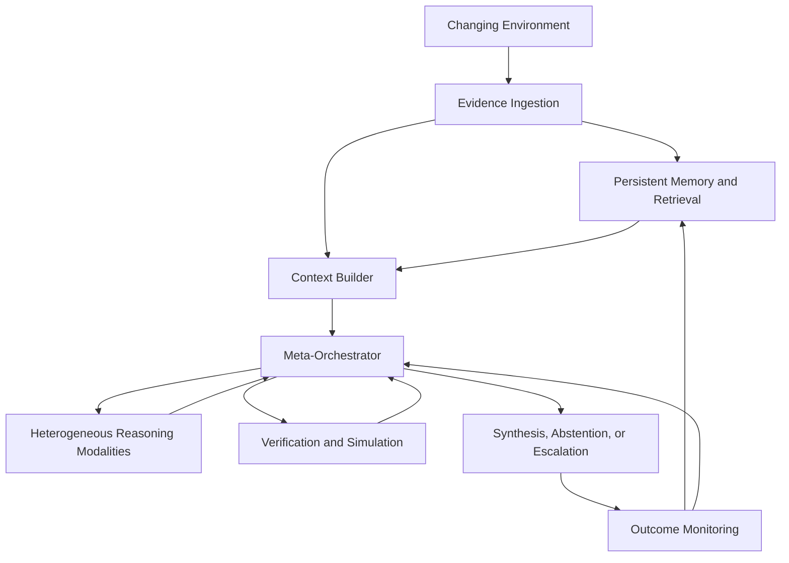

---
tags: [sihre, website, architecture]
status: draft
source: ingested
classification: public-after-review
created: 2026-05-23
updated: 2026-05-23
original_path: raw_ingest/SIHRE_Wiki_Content_Pack/01_Public_Website_Content/Architecture_Page.md
---
# SIHRE Architecture Page

## Overview

SIHRE is organized as a layered reasoning architecture:

1. Evidence layer
2. Memory and retrieval layer
3. Heterogeneous reasoning layer
4. Verification layer
5. Simulation layer
6. Meta-orchestration layer
7. Adaptation and feedback layer
8. Interface layer

## Core architectural idea

The meta-orchestrator governs which reasoning pathways are used, how much trust they receive, when additional evidence is required, and when validation or simulation should be invoked.

## Public-safe architecture diagram

