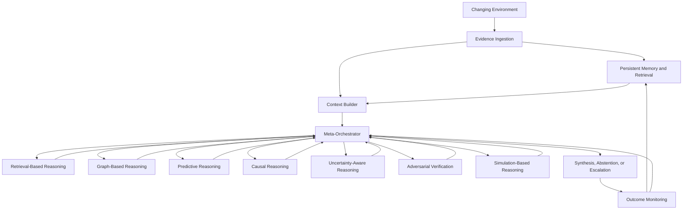
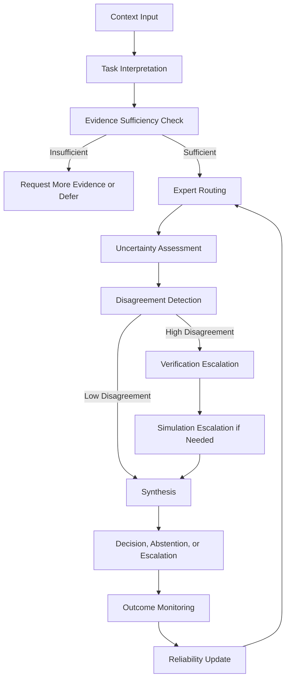
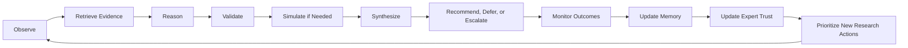

# SIHRE Public-Safe Mermaid Diagram Pack

## High-level architecture

```mermaid
flowchart TD
    A[Changing Environment] --> B[Evidence Ingestion]
    B --> C[Persistent Memory and Retrieval]
    B --> D[Context Builder]
    C --> D
    D --> O[Meta-Orchestrator]
    O --> R1[Retrieval-Based Reasoning]
    O --> R2[Graph-Based Reasoning]
    O --> R3[Predictive Reasoning]
    O --> R4[Causal Reasoning]
    O --> R5[Uncertainty-Aware Reasoning]
    O --> R6[Adversarial Verification]
    O --> R7[Simulation-Based Reasoning]
    R1 --> O
    R2 --> O
    R3 --> O
    R4 --> O
    R5 --> O
    R6 --> O
    R7 --> O
    O --> S[Synthesis, Abstention, or Escalation]
    S --> M[Outcome Monitoring]
    M --> C
    M --> O
```

## Meta-orchestrator workflow

```mermaid
flowchart TD
    A[Context Input] --> B[Task Interpretation]
    B --> C[Evidence Sufficiency Check]
    C -->|Insufficient| D[Request More Evidence or Defer]
    C -->|Sufficient| E[Expert Routing]
    E --> F[Uncertainty Assessment]
    F --> G[Disagreement Detection]
    G -->|Low Disagreement| H[Synthesis]
    G -->|High Disagreement| I[Verification Escalation]
    I --> J[Simulation Escalation if Needed]
    J --> H
    H --> K[Decision, Abstention, or Escalation]
    K --> L[Outcome Monitoring]
    L --> M[Reliability Update]
    M --> E
```

## Self-improvement loop

```mermaid
flowchart LR
    A[Observe] --> B[Retrieve Evidence]
    B --> C[Reason]
    C --> D[Validate]
    D --> E[Simulate if Needed]
    E --> F[Synthesize]
    F --> G[Recommend, Defer, or Escalate]
    G --> H[Monitor Outcomes]
    H --> I[Update Memory]
    I --> J[Update Expert Trust]
    J --> K[Prioritize New Research Actions]
    K --> A
```
